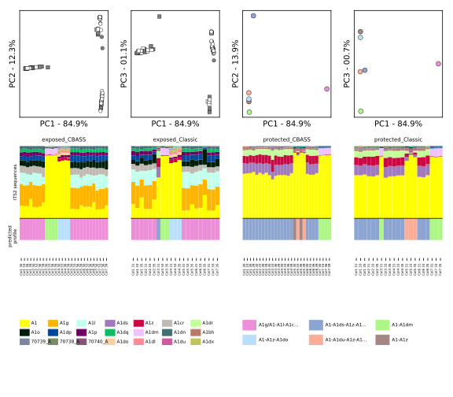
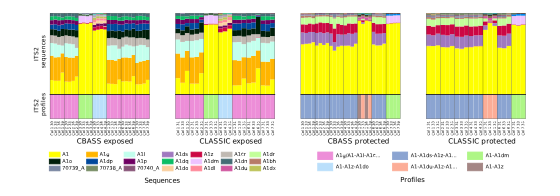

### Creating the ITS2 sequences and ITS2 type profile combined figure used in the MS

A python scipt is used to generate this figure.


#### Python environment setup
The python package requirements are in requirements.txt

This file can be used directly as an argument to pip:

``` $ pip install -r requirements.txt```

#### Generating the figure
To generate the figure simply run the `cbass_classic.py` script:

#### Raw figure output
This is the figure that is generated by the script:



#### The final figure for the MS:
This is the final figure for the MS:



NB Two samples were mislabelled and were swapped to get from the figure output 
by the code to the final figure shown here. These samples are obvious in the 
code-output figure. As annotated in the code-output figure, Col3 31 from exposed Classic was 
swapped with Col3 31 from protected Classic.
