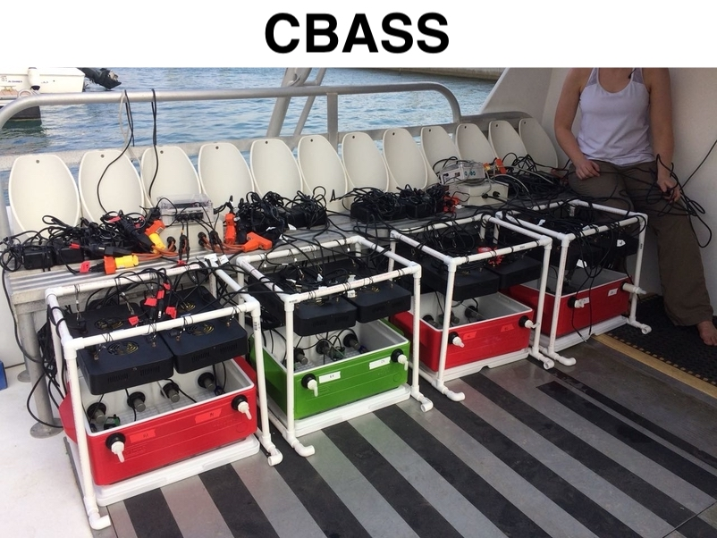
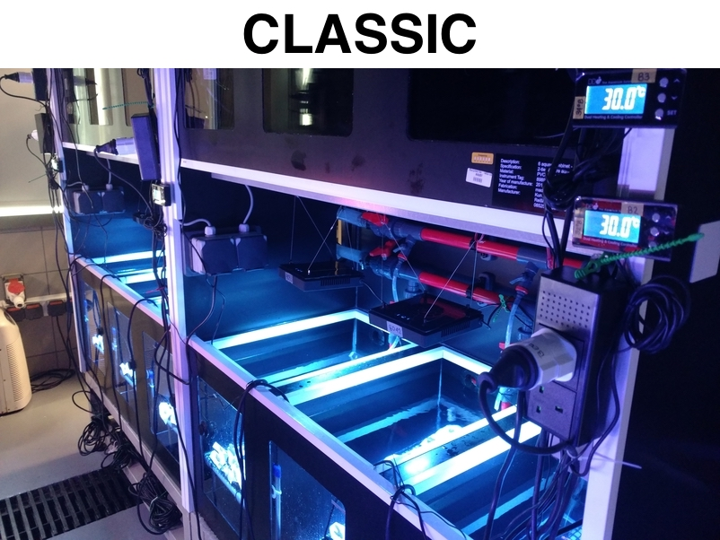

# CBASSvsCLASSIC
This repository contains the scripts used to run analyses and create figures for the manuscript “Standardized short‐term acute heat stress assays resolve historical differences in coral thermotolerance across microhabitat reef sites”, where we introduce our newly developed Coral Bleaching Automated Stress System (CBASS). This research provides a direct comparison between CBASS and a more commonly used  long-term aquarium heat stress experiment (CLASSIC) to demonstrate differences in coral thermotolerance shaped by small-scale environmental factors.

 
 

For more details on how to set up each of the scripts, please see the readme in the corresponding directory.
